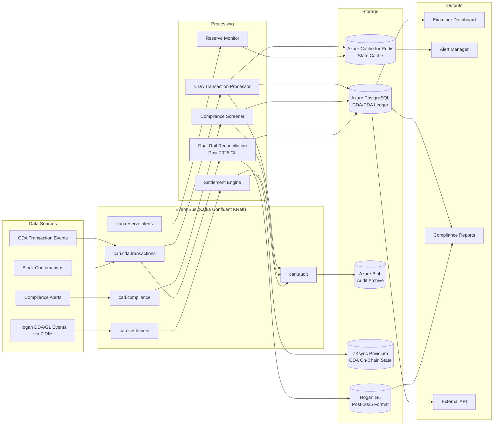
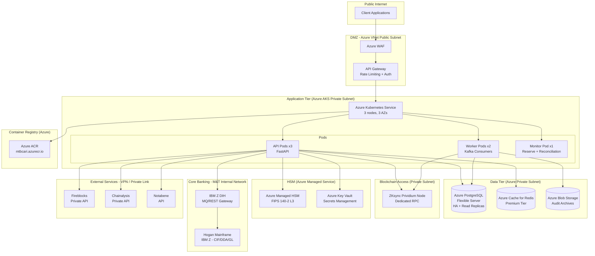
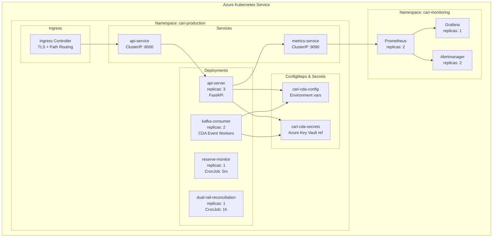

# Target-State Architecture

**M&T Bank | Cari Network Cari Deposit Account (CDA) Platform**
**ARB Submission -- Architecture Diagrams**

---

## 1. System Architecture (Target State -- Production)

```mermaid
graph TB
    subgraph "External Clients"
        IC[Institutional Clients]
        CB[Commercial Banking Portal]
        API_EXT[Partner API Gateway]
    end

    subgraph "M&T Bank - Application Layer - Azure AKS"
        direction TB
        LB[Azure Application Gateway<br/>WAF + TLS Termination]
        
        subgraph "API Tier (AKS Namespace: cari-production)"
            FAST[FastAPI Orchestrator<br/>offchain/main.py]
            MINT_R[CDA Mint/Burn Router]
            SETTLE_R[Settlement Router]
            RECON_R["Reconciliation Router<br/>Post-2025 GL"]
            COMPLY_R[Compliance Router]
            RESERVE_R[Reserve Monitor Router]
        end

        subgraph "Service Tier"
            BLOCKCHAIN[Blockchain Service<br/>Web3 + Contract ABIs]
            COMPLIANCE[Compliance Service<br/>AML/OFAC + Travel Rule]
            AUDIT[Audit Service<br/>Immutable Event Log]
            RESERVE[Reserve Monitor<br/>1:1 CDA Backing Verification]
        end

        subgraph "Security Layer (Azure)"
            AKV[Azure Managed HSM<br/>FIPS 140-2 L3]
            SIGN[Signing Policy Engine<br/>Risk-Tiered Approvals]
            TIER[Wallet Tiering<br/>Hot / Warm / Cold]
            RESIL[Resilience Manager<br/>Circuit Breakers + DR]
        end

        subgraph "Integration Layer - Hogan/Z DIH"
            ZDIH["IBM Z DIH<br/>MQ/REST Gateway"]
            HOGAN["Hogan Mainframe<br/>IBM Z - CIF/DDA/GL"]
            CUSTODY[Custody Adapter<br/>Fireblocks MPC]
            PAYMENT["Payment Rails<br/>ACH/Fedwire/RTP/FedNow<br/>via Hogan"]
        end
    end

    subgraph "Middleware (Azure)"
        KAFKA["Kafka Event Bus<br/>Confluent Platform KRaft"]
        REDIS[Redis Cache<br/>Azure Cache]
        ACR[Azure ACR<br/>mtbcari.azurecr.io]
    end

    subgraph "ZKsync Prividium (Cari Network)"
        direction TB
        RPC[JSON-RPC Endpoint<br/>Prividium Node]
        
        subgraph "Smart Contracts"
            TOKEN[MTBankTokenizedDeposit<br/>CDA ERC-20 + UUPS Proxy]
            ORACLE[CariComplianceOracle<br/>KYC/AML/OFAC]
            ATTEST[ReserveAttestationContract]
        end
        
        subgraph "Cari Network Layer"
            OPERATOR[Operator<br/>M&T CDA Supply Controller]
            SBANK[Settlement Bank<br/>Daily Net Settlement]
            BRIDGE[Messaging Bridge<br/>Cross-Bank Comms]
        end
    end

    subgraph "External Services"
        CHAINALYSIS[Chainalysis KYT<br/>AML/OFAC Screening]
        NOTABENE[Notabene<br/>Travel Rule VASP]
        CHRONICLE[Chronicle Protocol<br/>Reserve Attestation]
        FIREBLOCKS[Fireblocks<br/>MPC Custody]
    end

    subgraph "Monitoring & Observability (Azure)"
        PROM[Prometheus<br/>Metrics Collection]
        GRAF[Grafana<br/>Dashboards + Alerts]
        PAGER[PagerDuty<br/>Incident Management]
        AZMON[Azure Monitor<br/>Log Analytics]
    end

    IC --> LB
    CB --> LB
    API_EXT --> LB
    LB --> FAST

    FAST --> MINT_R
    FAST --> SETTLE_R
    FAST --> RECON_R
    FAST --> COMPLY_R
    FAST --> RESERVE_R

    MINT_R --> BLOCKCHAIN
    MINT_R --> COMPLIANCE
    SETTLE_R --> BLOCKCHAIN
    SETTLE_R --> COMPLIANCE
    RECON_R --> RESERVE
    COMPLY_R --> COMPLIANCE
    RESERVE_R --> RESERVE

    BLOCKCHAIN --> AKV
    BLOCKCHAIN --> SIGN
    AKV --> TIER
    SIGN --> RESIL

    BLOCKCHAIN --> RPC
    RPC --> TOKEN
    RPC --> ORACLE
    RPC --> ATTEST

    TOKEN --> OPERATOR
    OPERATOR --> SBANK
    SBANK --> BRIDGE

    COMPLIANCE --> CHAINALYSIS
    COMPLIANCE --> NOTABENE
    RESERVE --> CHRONICLE

    TIER --> FIREBLOCKS
    TIER --> CUSTODY

    BLOCKCHAIN --> KAFKA
    COMPLIANCE --> KAFKA
    AUDIT --> KAFKA
    FAST --> REDIS

    FAST --> ZDIH
    ZDIH --> HOGAN
    HOGAN --> PAYMENT

    FAST --> PROM
    PROM --> GRAF
    GRAF --> PAGER
    FAST --> AZMON
```

---

## 2. Data Flow Architecture

---

## 3. Network Architecture

---

## 4. Deployment Architecture (Kubernetes)

---

*ARB Submission -- Architecture Diagrams*
*M&T Bank | Cari Network CDA Platform | ZKsync Prividium*
