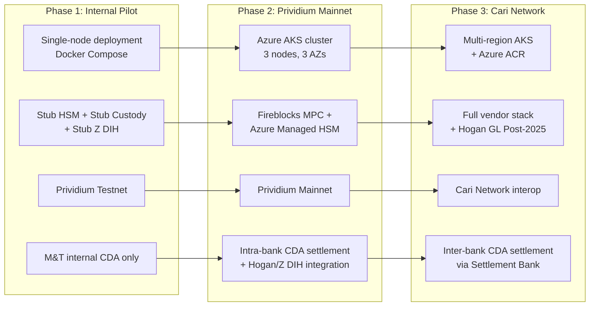
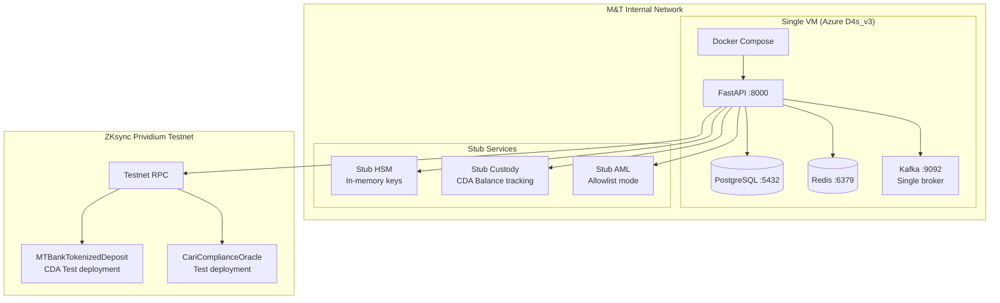
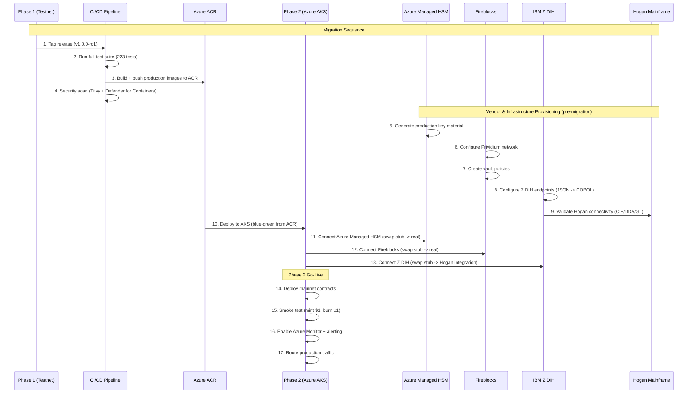
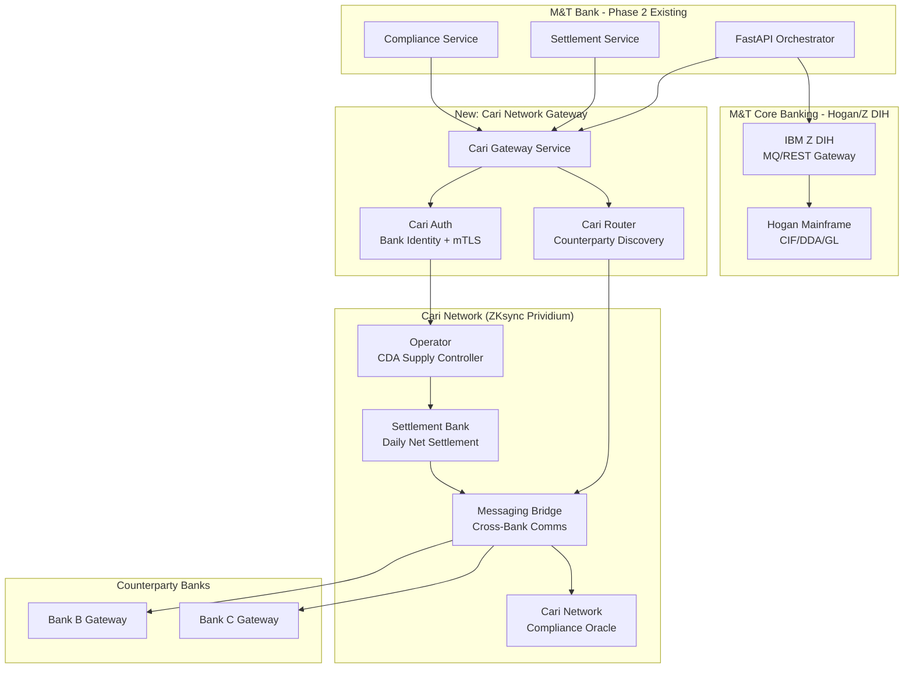

# Transitional Architecture

**M&T Bank | Cari Network Cari Deposit Account (CDA) Platform**
**ARB Submission -- Pilot to Production Migration**

---

## 1. Architecture Evolution Phases



---

## 2. Phase 1: Internal Pilot Architecture

**Purpose:** Validate end-to-end CDA flows with M&T Treasury Operations on testnet.



### Phase 1 Configuration

| Component | Pilot Config | Production Config |
|-----------|-------------|-------------------|
| Compute | 1x Azure D4s_v3 | 3x Azure AKS nodes (3 AZs) |
| Container Registry | Local Docker | Azure ACR (mtbcari.azurecr.io) |
| Database | PostgreSQL (single) | Azure PostgreSQL Flexible (HA) |
| Cache | Redis (single) | Azure Cache Premium (cluster) |
| HSM | Stub (in-memory) | Azure Managed HSM (FIPS 140-2 L3) |
| Custody | Stub (balance tracking) | Fireblocks MPC |
| AML/OFAC | Stub (allowlist) | Chainalysis KYT (real-time) |
| Core Banking | Stub Z DIH (mock responses) | IBM Z DIH -> Hogan mainframe |
| GL Format | Stub GL (JSON) | Hogan GL (Post-2025, ISO 20022) |
| Blockchain | Prividium testnet | Prividium mainnet |
| Event Bus | Kafka (single broker) | Kafka Confluent Platform (KRaft) |
| Monitoring | Console logging | Prometheus + Grafana + Azure Monitor |

---

## 3. Phase 1 -> Phase 2 Migration

### Migration Steps



### Configuration Changes (Pilot -> Mainnet)

```yaml
# Phase 1 (Pilot)
environment: dev
blockchain:
  network: prividium-testnet
  rpc_url: https://testnet.prividium.zksync.io
hsm:
  provider: stub
custody:
  provider: stub
compliance:
  aml_provider: stub
  aml_mode: allowlist
core_banking:
  provider: stub_zdih
  hogan_enabled: false
container_registry: local
event_bus:
  provider: kafka
  mode: single-broker

# Phase 2 (Mainnet)
environment: production
blockchain:
  network: prividium-mainnet
  rpc_url: https://mainnet.prividium.zksync.io
hsm:
  provider: azure_managed_hsm
  resource_id: /subscriptions/.../managedHSMs/cari-prod
custody:
  provider: fireblocks
  api_key: ${FIREBLOCKS_API_KEY}
  vault_id: ${FIREBLOCKS_VAULT_ID}
compliance:
  aml_provider: chainalysis
  api_key: ${CHAINALYSIS_API_KEY}
  aml_mode: realtime
core_banking:
  provider: ibm_z_dih
  zdih_url: ${ZDIH_GATEWAY_URL}
  hogan_enabled: true
  gl_format: post_2025_iso20022
container_registry: mtbcari.azurecr.io
event_bus:
  provider: kafka
  mode: confluent_kraft
  bootstrap_servers: ${KAFKA_BOOTSTRAP_SERVERS}
```

---

## 4. Phase 2 -> Phase 3 Migration (Cari Network Interop)

### New Components for Inter-Bank CDA Settlement



### Phase 3 Additions

| Component | Purpose | Integration Point |
|-----------|---------|-------------------|
| Cari Gateway Service | Inter-bank CDA message routing | New microservice alongside FastAPI |
| Cari Auth (mTLS) | Bank identity verification | Certificate-based mutual TLS |
| Cari Router | Counterparty bank discovery | Cari Network directory service |
| Operator Contract | M&T Bank controls CDA supply (mint/burn) | OPERATOR_ROLE on-chain |
| Settlement Bank | Daily net settlement of CDA transfers | SETTLEMENT_BANK_ROLE on-chain |
| Messaging Bridge | Cross-bank CDA transfer communication | New Prividium contract deployment |
| Hogan GL Integration | Post-2025 GL format for dual-rail reconciliation | Z DIH -> Hogan GL subsystem |
| Azure ACR | Container images for multi-region AKS | mtbcari.azurecr.io |

### Migration Path: GHCR -> Azure ACR

| Phase | Container Registry | Notes |
|-------|-------------------|-------|
| Phase 1 (Pilot) | Local Docker / GHCR | Development convenience |
| Phase 2 (Mainnet) | Azure ACR (mtbcari.azurecr.io) | M&T standard; geo-replication |
| Phase 3 (Cari Network) | Azure ACR (multi-region) | Cross-AZ resilience |

---

## 5. Rollback Strategy

Each phase supports full rollback:

| Phase Transition | Rollback Method | RTO |
|-----------------|-----------------|-----|
| Phase 1 -> Phase 2 | Blue-green deployment; switch back to blue | 5 minutes |
| Phase 2 -> Phase 3 | Disable Cari Gateway; revert to intra-bank only | 10 minutes |
| Smart contract upgrade | UUPS proxy -- revert to previous implementation | 1 block (~2 seconds) |
| Vendor failover | Switch custody/AML to secondary provider | 15 minutes |

### Emergency Procedures

```
CRITICAL ROLLBACK (smart contract vulnerability):
1. PAUSER key holder pauses CDA token contract (immediate)
2. Engineering reviews vulnerability
3. Deploy patched implementation via UUPS proxy
4. UPGRADER key holder upgrades (dual approval required)
5. Resume CDA operations after verification

NON-CRITICAL ROLLBACK (API service issue):
1. AKS deployment rollback: kubectl rollout undo
2. Verify health checks passing
3. Investigate root cause
4. Deploy fix through normal CI/CD pipeline
```

---

*ARB Submission -- Transitional Architecture*
*M&T Bank | Cari Network CDA Platform | ZKsync Prividium*
