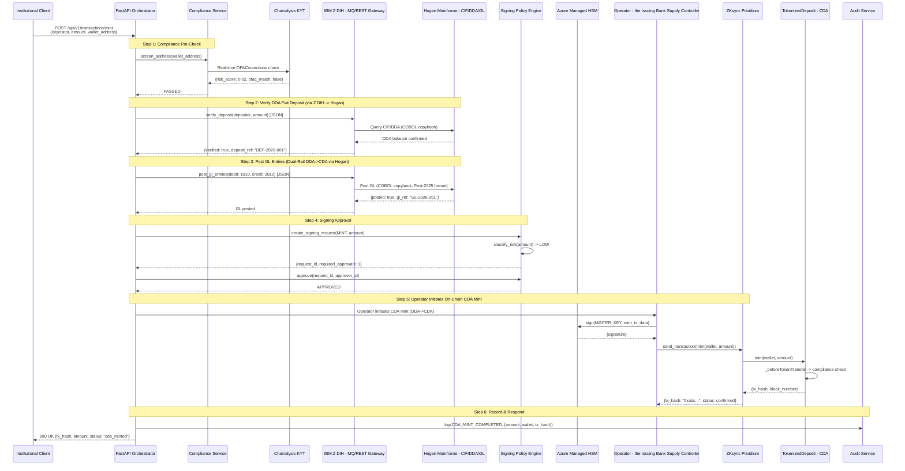
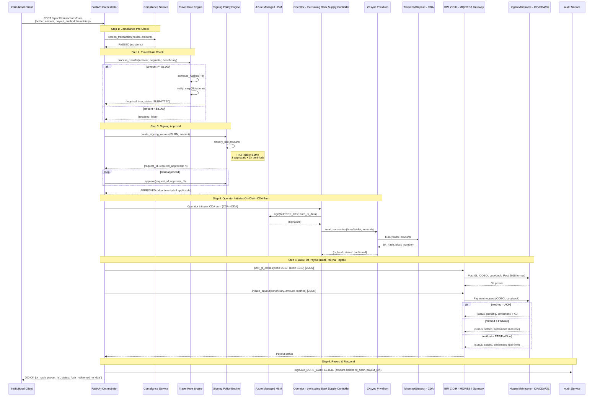
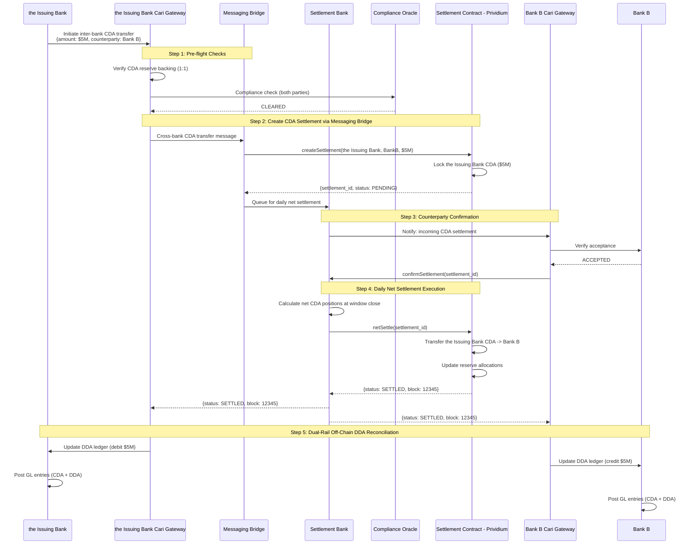
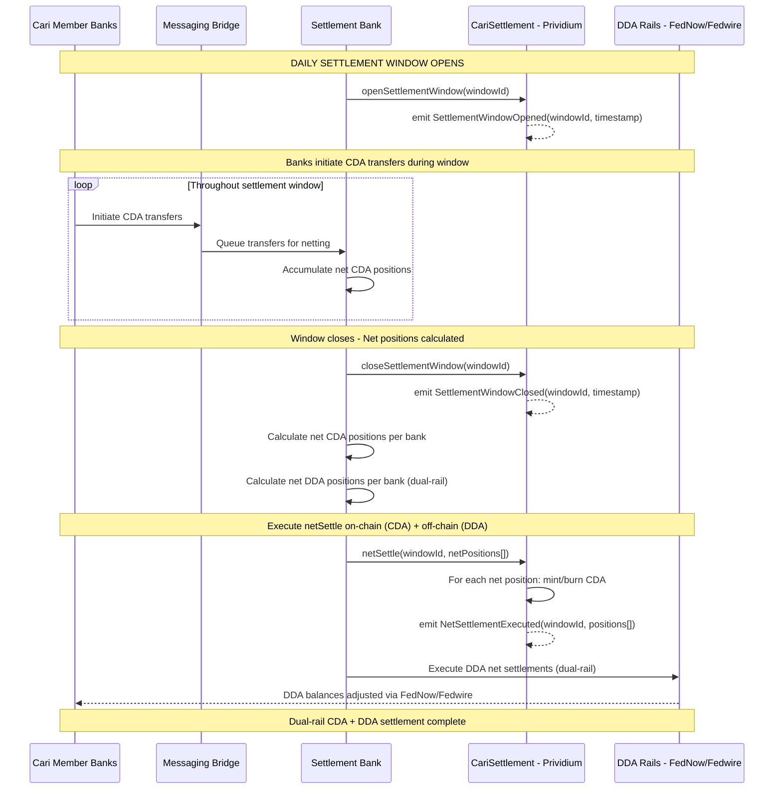
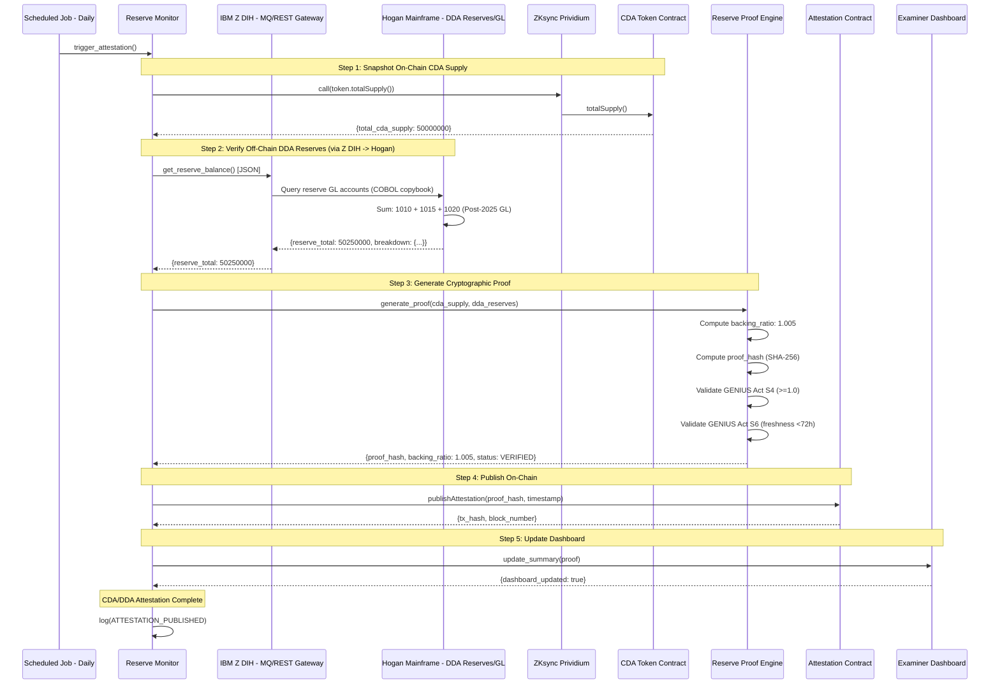
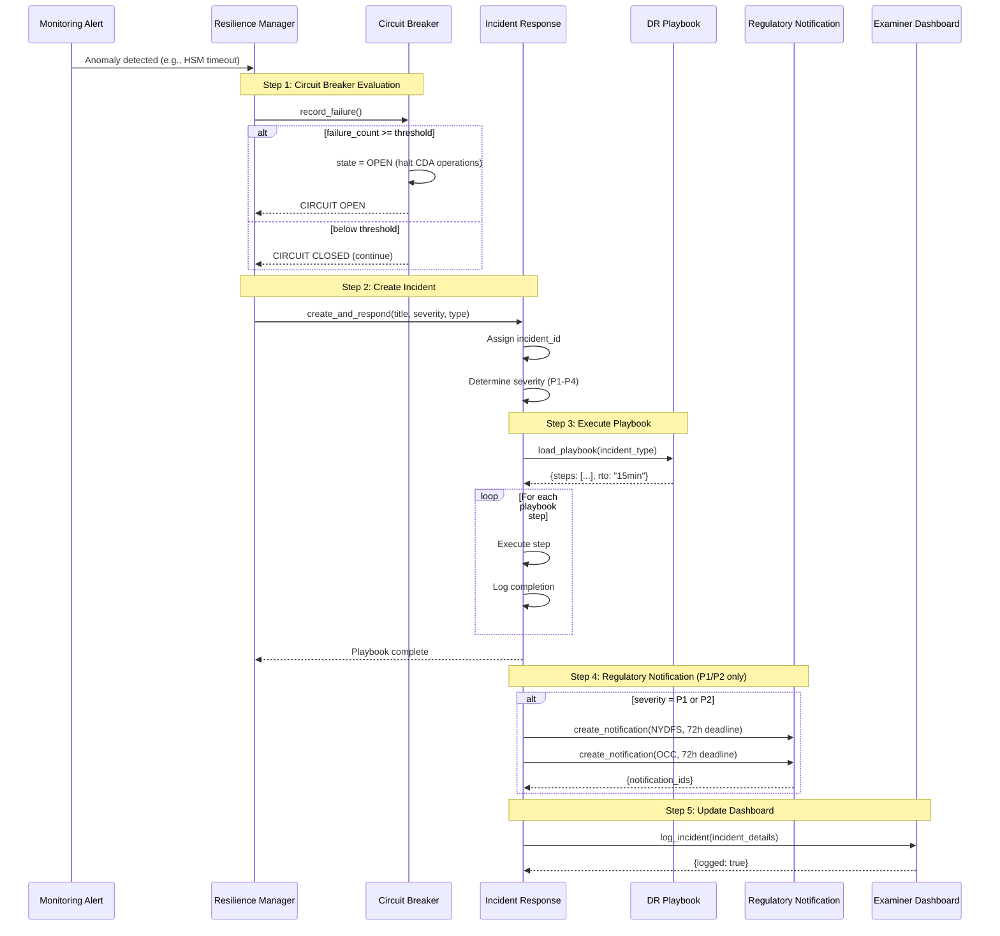
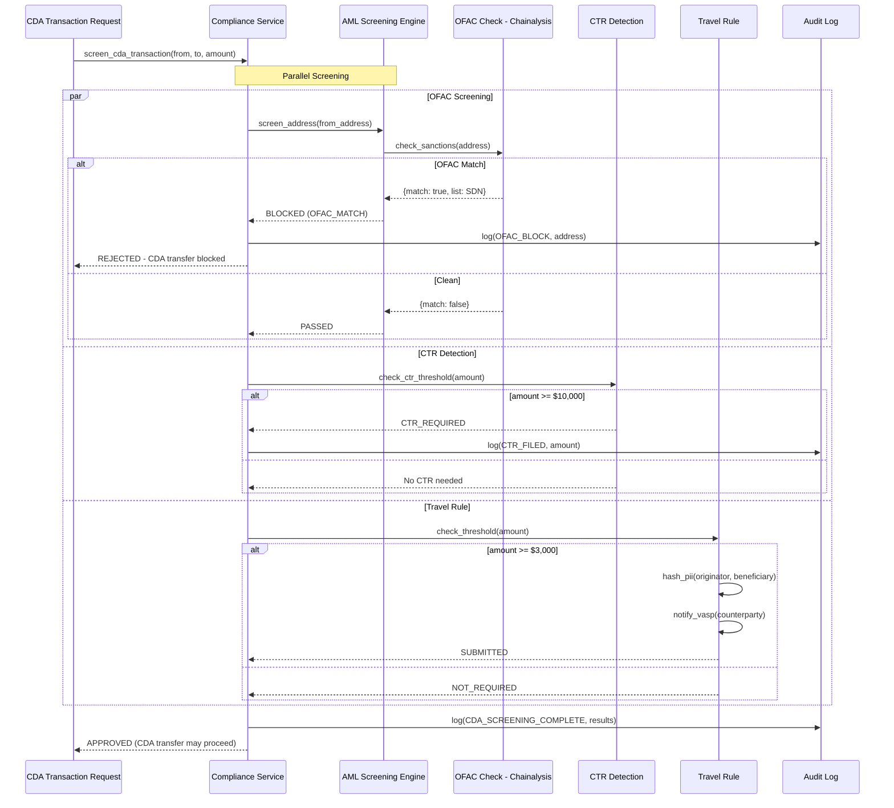

# End-to-End Transaction Flows

**The Issuing Bank | Cari Network Cari Deposit Account (CDA) Platform**
**ARB Submission -- Transaction Flow Documentation**

---

## 1. CDA Mint Flow (DDA Deposit -> CDA Token Creation via Operator)

---

## 2. CDA Burn/Redeem Flow (CDA -> DDA Fiat Payout via Operator)

---

## 3. Inter-Bank CDA Settlement Flow (via Settlement Bank & Messaging Bridge)

---

## 4. Daily Net Settlement Flow (Settlement Bank)

---

## 5. Reserve Attestation Flow

---

## 6. Incident Response Flow

---

## 7. AML/OFAC Screening Flow (CDA Transactions)

---

*ARB Submission -- End-to-End Transaction Flows*
*The Issuing Bank | Cari Network CDA Platform | ZKsync Prividium*
