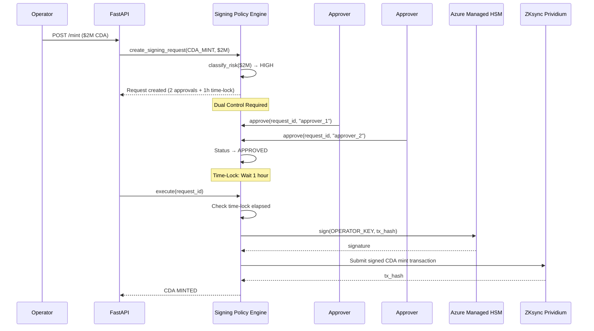
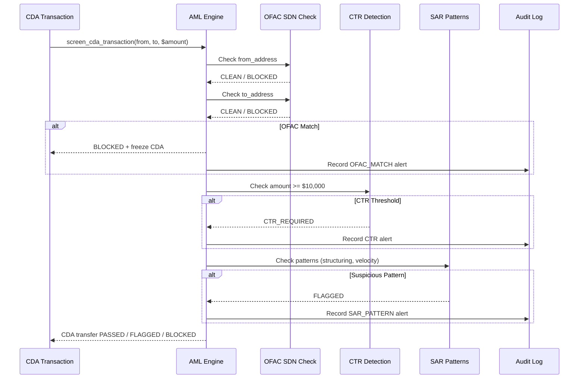
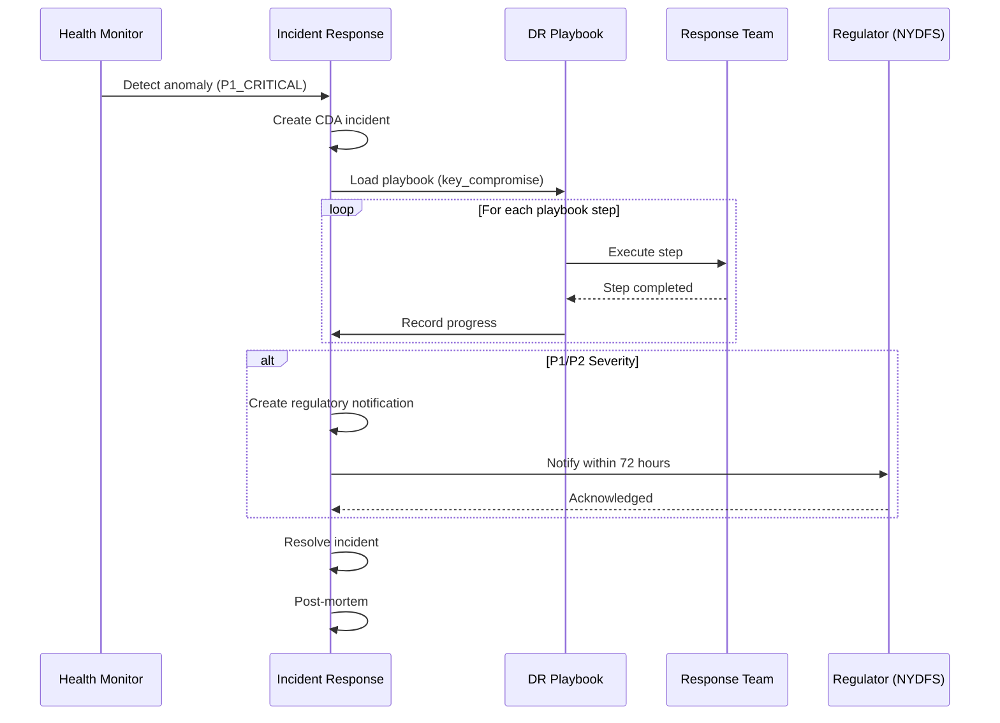

# Architecture Flow Diagrams — Security, Risk & Compliance Layer

## M&T Bank Technology Stack

- **Hogan mainframe** (IBM Z) — Core banking (CIF/DDA/GL)
- **IBM Z DIH** — MQ/REST gateway for API-to-Hogan integration
- **Kafka** (Confluent Platform, KRaft mode) — Event bus
- **Azure AKS** — Kubernetes orchestration
- **Azure ACR** (mtbcari.azurecr.io) — Container registry
- **Azure Managed HSM** — Key management

## Security Guardian Architecture

```mermaid
graph TB
    subgraph "Security Layer (Azure)"
        KM[Key Management<br/>Azure Managed HSM]
        SP[Signing Policy<br/>Dual Control]
        WT[Wallet Tiering<br/>Hot/Warm/Cold]
        DR[Resilience<br/>DR Playbooks]
    end

    subgraph "Compliance Layer"
        AML[AML/OFAC<br/>CDA Real-time + Batch]
        TR[Travel Rule<br/>FinCEN + Notabene]
        RP[Reserve Proof<br/>CDA/DDA Cryptographic]
        ED[Examiner Dashboard<br/>Regulatory Reporting]
    end

    subgraph "Risk Layer"
        RM[Risk Matrix<br/>12 Baseline Risks]
        CM[Control Matrix<br/>20 Controls]
        IR[Incident Response<br/>Playbook Execution]
    end

    subgraph "Quest 2 — Off-Chain Platform (DDA Layer via Hogan)"
        API[FastAPI Routers]
        BC[Blockchain Service]
        ZDIH[IBM Z DIH<br/>(MQ/REST Gateway)]
        HOGAN[Hogan Mainframe<br/>(CIF/DDA/GL)]
        CU[Custody Adapters]
    end

    subgraph "Quest 1 — Smart Contracts (CDA Layer)"
        MTD[MTokenizedDeposit<br/>(CDA)]
        RO[ReserveOracle]
        CS[CariSettlement]
        OP[Operator<br/>CDA Supply Control]
        SB[Settlement Bank<br/>Daily Net Settlement]
    end

    API --> SP
    SP --> KM
    KM --> BC
    BC --> MTD
    BC --> RO
    BC --> CS
    BC --> OP
    BC --> SB

    API --> AML
    API --> TR

    API --> ZDIH
    ZDIH --> HOGAN

    CU --> WT
    WT --> CU

    DR --> API

    RP --> RO
    RP --> HOGAN

    ED --> RM
    ED --> CM
    ED --> AML
    ED --> RP

    IR --> DR
```

## Signing Policy Flow



## AML Screening Flow (CDA Transactions)



## Incident Response Flow



## Reserve Proof Verification (CDA/DDA Dual-Rail via Hogan)

```mermaid
graph LR
    subgraph "On-Chain CDA State"
        Supply[Total CDA Supply<br/>MTokenizedDeposit]
        Oracle[ReserveOracle<br/>Attestation Hash]
    end

    subgraph "Off-Chain DDA Reserves (Hogan GL)"
        TB[US Treasury Bills<br/>60% — GL 1015]
        FDIC[FDIC Deposits<br/>30% — GL 1010]
        RRP[Fed Reverse Repo<br/>10% — GL 1020]
    end

    subgraph "Proof Engine"
        PE[ReserveProofEngine]
        Hash[SHA-256 Proof Hash]
    end

    subgraph "Hogan Integration"
        ZDIH[IBM Z DIH<br/>(MQ/REST Gateway)]
        HOGAN[Hogan GL Subsystem<br/>(Post-2025 Format)]
    end

    Supply --> PE
    Oracle --> PE
    TB --> ZDIH
    FDIC --> ZDIH
    RRP --> ZDIH
    ZDIH --> HOGAN
    HOGAN --> PE
    PE --> Hash

    Hash --> |"CDA/DDA ratio >= 1.0"| Verified[VERIFIED ✓]
    Hash --> |"CDA/DDA ratio < 1.0"| Failed[FAILED ✗]
```
