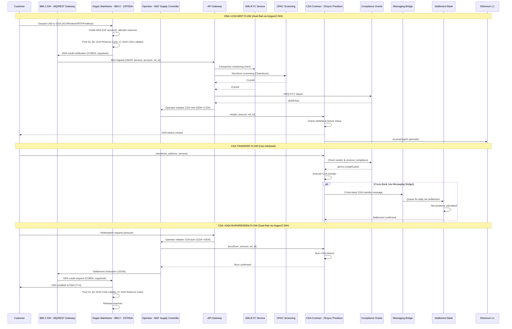

# StableArch Council - Architecture Diagram

## System Architecture (Mermaid)

```mermaid
graph TB
    subgraph "StableArch Council (CrewAI Hierarchical Process)"
        ORC["Orchestrator<br/>Chief Enterprise Architect<br/>(Manager Agent)"]
        SPA["Cari Deposit Platform<br/>Architect"]
        TSE["Blockchain Technology<br/>Stack Expert"]
        SRG["Security, Risk &<br/>Compliance Guardian"]
        SAA["Strategic Advisory<br/>Agent"]
        ORC -->|delegates & synthesizes| SPA
        ORC -->|delegates & synthesizes| TSE
        ORC -->|delegates & synthesizes| SRG
        ORC -->|delegates & synthesizes| SAA
    end

    subgraph "M&T Bank Cari Deposit Platform on ZKsync Prividium"
        subgraph "On-Chain (ZKsync Prividium L2)"
            TC["CDA Token Contract<br/>(ERC-20, UUPS Upgradeable)"]
            ACREG["Access Control<br/>Registry"]
            CO["Compliance Oracle<br/>(KYC/AML/OFAC)"]
            OP["Operator<br/>(M&T Bank Supply Controller)"]
            RPM["Reserve Proof<br/>Module (zk-attestation)"]
        end

        subgraph "Off-Chain Services (DDA Layer)"
            ZDIH["IBM Z DIH<br/>MQ/REST Gateway"]
            HOGAN["Hogan Mainframe<br/>IBM Z - CIF/DDA"]
            RAS["Reserve Attestation<br/>Service"]
            RE["Reconciliation<br/>Engine - Post-2025 GL"]
            EI["Event Indexer"]
            API["API Gateway<br/>REST/GraphQL"]
            AML["AML Transaction<br/>Monitoring"]
            TR["Travel Rule<br/>Service - Notabene"]
        end

        subgraph "Infrastructure - Azure"
            AKS["Azure AKS<br/>Kubernetes"]
            ACR["Azure ACR<br/>mtbcari.azurecr.io"]
            AKV["Azure Key Vault<br/>Managed HSM"]
            CUST["Custody Integration<br/>Fireblocks/BitGo"]
            MON["Observability Stack<br/>Prometheus/Grafana"]
            CICD["CI/CD Pipeline<br/>Hardhat/Foundry"]
            KAFKA["Kafka Event Bus<br/>Confluent KRaft"]
        end
    end

    subgraph "Cari Network"
        SBANK["Settlement Bank<br/>(Daily Net Settlement)"]
        CIL["Messaging Bridge<br/>(Cross-Bank Comms)"]
        SKR["Shared KYC<br/>Registry"]
        RULEBOOK["Cari Rulebook<br/>Governance"]
        MB1["Member Bank 1"]
        MB2["Member Bank 2"]
        MBN["Member Bank N"]
    end

    subgraph "External Systems"
        ETH["Ethereum L1<br/>zk-proof anchoring"]
        FED["FedNow / ACH /<br/>Fedwire - DDA Rails"]
        OFAC["OFAC SDN List<br/>Chainalysis"]
        REG["Regulators<br/>OCC/Fed/NYDFS"]
    end

    subgraph "Regulatory Guardrails"
        GR["Automated Compliance<br/>Checks"]
        GR1["GENIUS Act S4:<br/>Reserve Backing"]
        GR2["GENIUS Act S5:<br/>Redemption at Par"]
        GR3["OFAC Screening"]
        GR4["Travel Rule"]
        GR5["Cari Rulebook<br/>Compliance"]
        GR --> GR1
        GR --> GR2
        GR --> GR3
        GR --> GR4
        GR --> GR5
    end

    %% Agent to Platform connections
    SPA -.->|designs| TC
    SPA -.->|designs| HOGAN
    TSE -.->|specifies| AKV
    TSE -.->|specifies| CICD
    SRG -.->|validates| GR
    SAA -.->|evaluates| CUST

    %% Dual-Rail: On-Chain CDA + Off-Chain DDA (via Hogan/Z DIH)
    API -->|JSON request| ZDIH
    ZDIH -->|COBOL copybook| HOGAN
    HOGAN -->|DDA debit| ZDIH
    ZDIH -->|DDA->CDA mint| OP
    OP -->|mint CDA| TC
    TC -->|burn CDA| OP
    OP -->|CDA->DDA burn| ZDIH
    ZDIH -->|DDA credit| HOGAN
    HOGAN -->|Post-2025 GL| RE
    TC --> ACREG
    TC --> CO
    RPM --> RAS
    ZDIH --> RE
    EI --> API
    AML --> CO
    TR --> CO
    API --> KAFKA
    KAFKA --> EI

    %% Cari Network connections
    TC <-->|cross-bank CDA transfers| CIL
    CO <-->|shared screening| SKR
    CIL --> SBANK
    SBANK -->|daily net settlement| MB1
    SBANK -->|daily net settlement| MB2
    SBANK -->|daily net settlement| MBN
    RULEBOOK --> CIL
    RULEBOOK --> SBANK

    %% External connections
    TC -->|zk-proofs| ETH
    HOGAN <-->|DDA fiat rails (ACH/Fedwire/RTP/FedNow)| FED
    CO <-->|sanctions| OFAC
    API -->|examiner access| REG
    CUST --> AKV

    %% Guardrail connections
    ORC -.->|enforces| GR

    %% Styling
    classDef agent fill:#1a73e8,stroke:#0d47a1,color:#fff
    classDef onchain fill:#4caf50,stroke:#2e7d32,color:#fff
    classDef offchain fill:#ff9800,stroke:#e65100,color:#fff
    classDef infra fill:#9c27b0,stroke:#6a1b9a,color:#fff
    classDef cari fill:#00bcd4,stroke:#006064,color:#fff
    classDef external fill:#f44336,stroke:#b71c1c,color:#fff
    classDef guardrail fill:#ffc107,stroke:#f57f17,color:#000

    class ORC,SPA,TSE,SRG,SAA agent
    class TC,ACREG,CO,OP,RPM onchain
    class ZDIH,HOGAN,RAS,RE,EI,API,AML,TR offchain
    class AKS,ACR,AKV,CUST,MON,CICD,KAFKA infra
    class SBANK,CIL,SKR,RULEBOOK,MB1,MB2,MBN cari
    class ETH,FED,OFAC,REG external
    class GR,GR1,GR2,GR3,GR4,GR5 guardrail
```

## Data Flow: DDA Deposit -> CDA Mint -> Transfer -> Redeem


