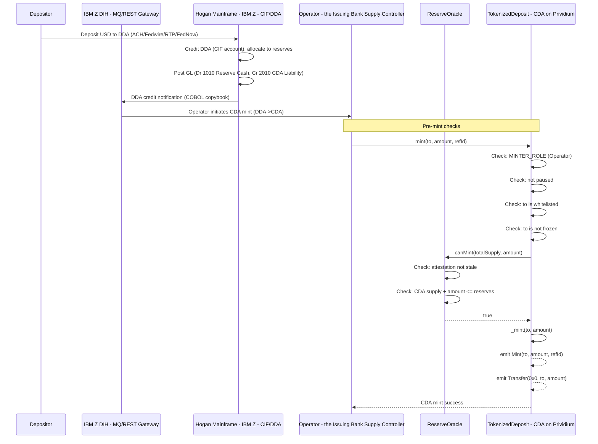
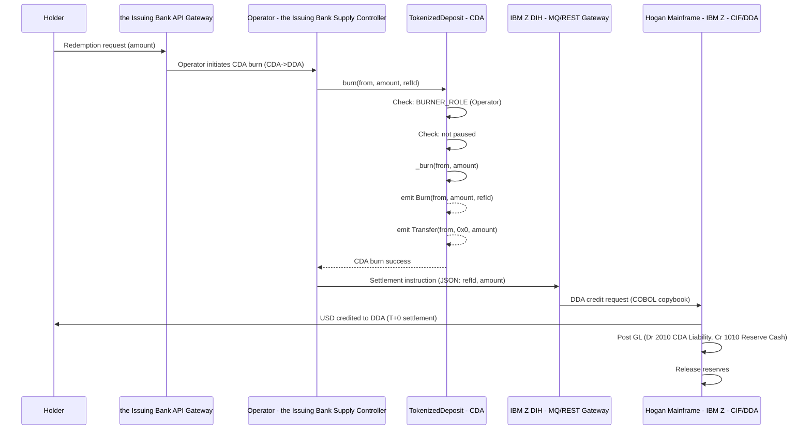
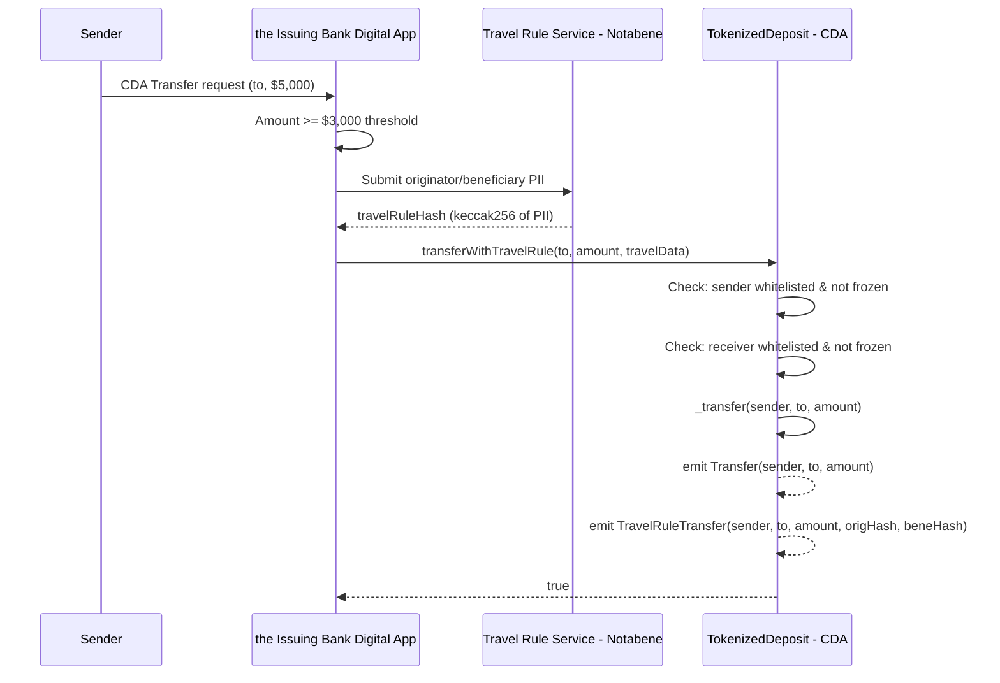
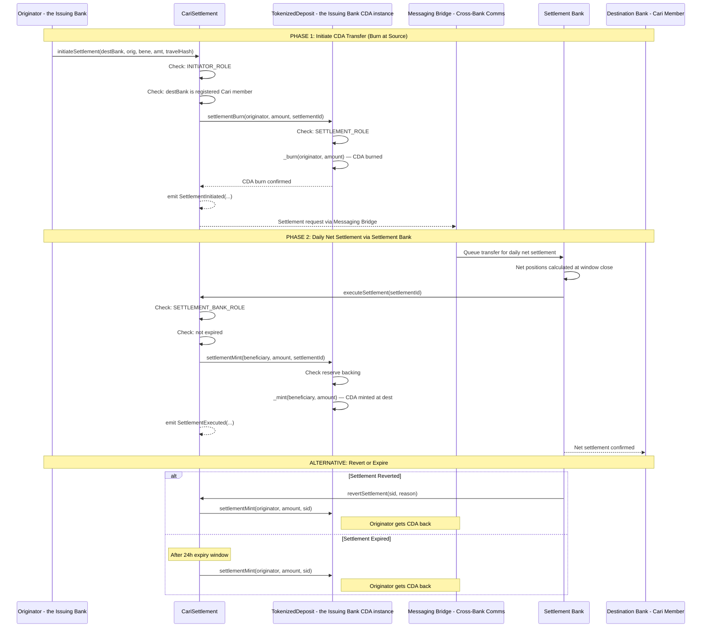
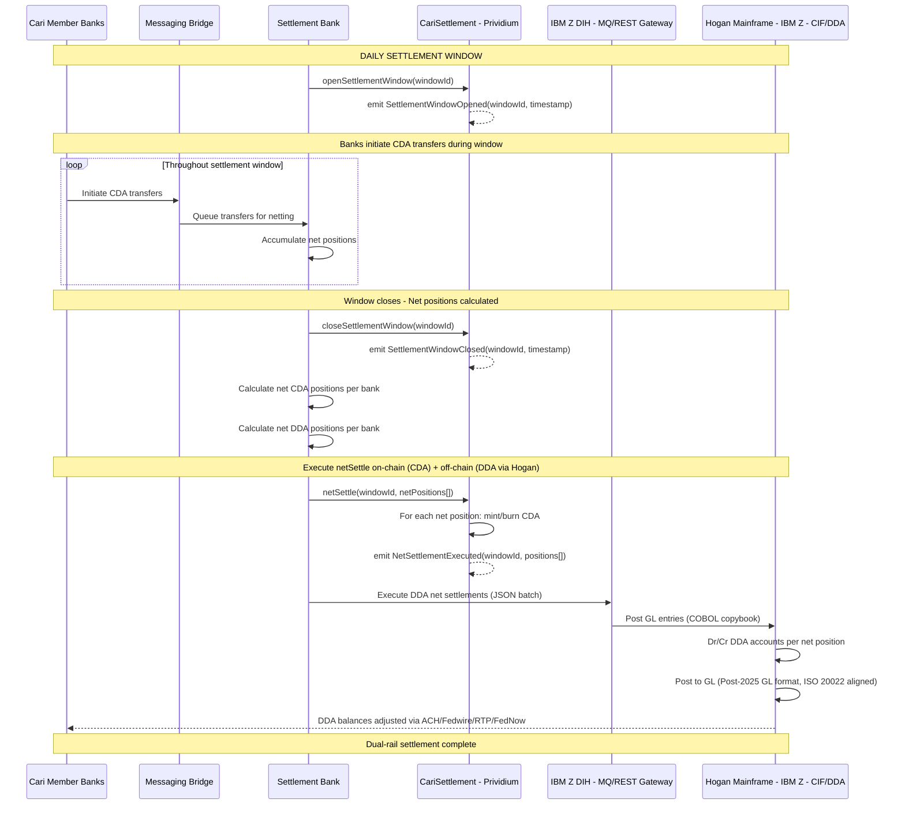
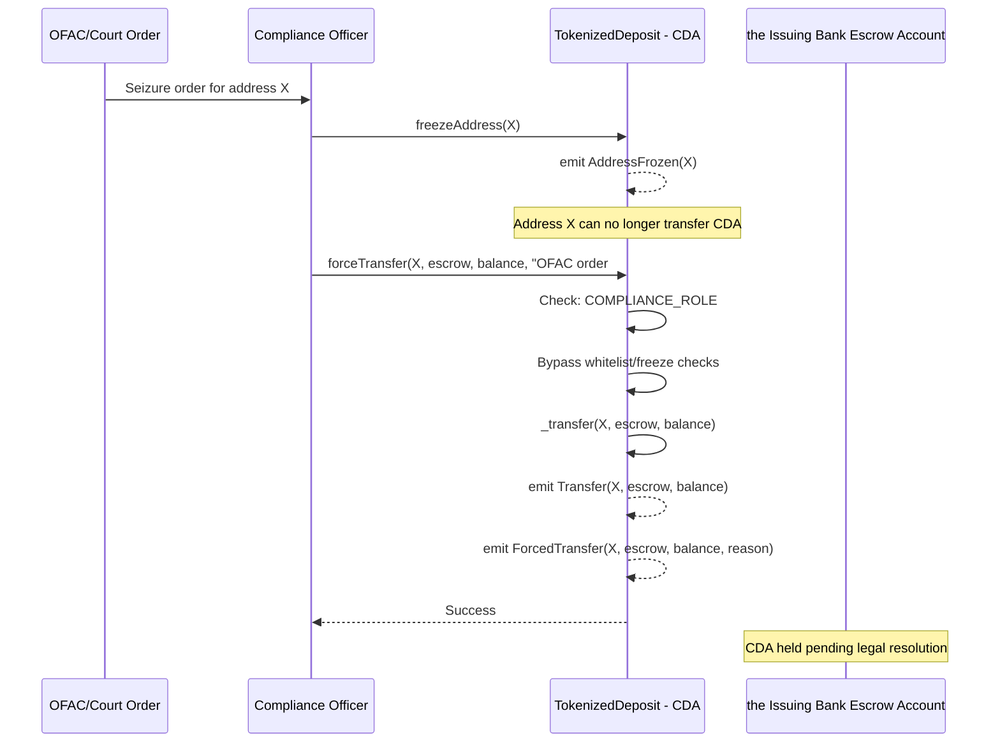

# On-Chain Flow Diagrams

## CDA Mint Flow (DDA Deposit -> CDA Mint via Operator)

## CDA Burn Flow (CDA -> DDA Redemption at Par - GENIUS Act S5)

## CDA Transfer with Travel Rule (FinCEN >= $3,000)

## Cari Cross-Bank CDA Settlement via Messaging Bridge

## Daily Net Settlement Flow (Settlement Bank)

## Force Transfer (OFAC Seizure)

