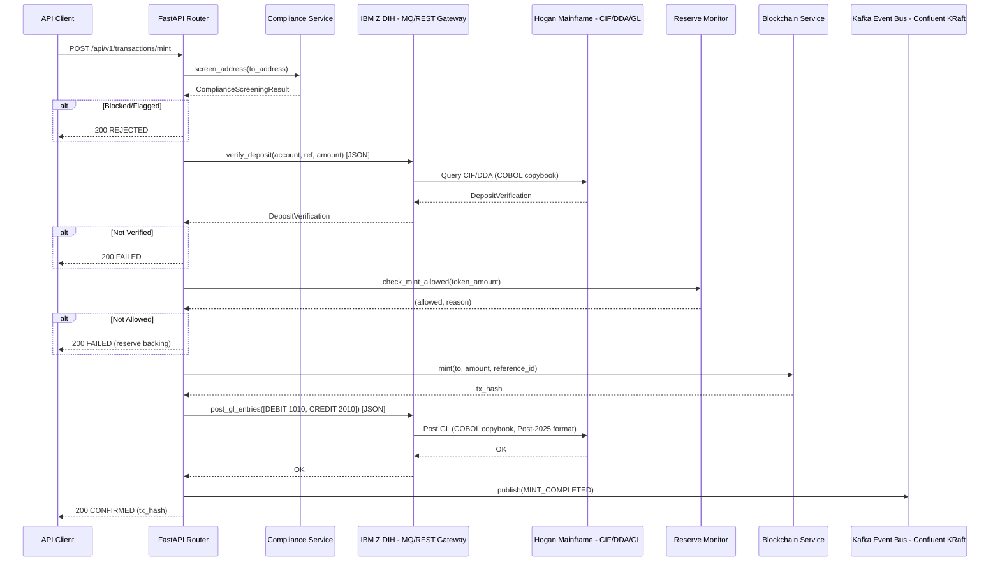
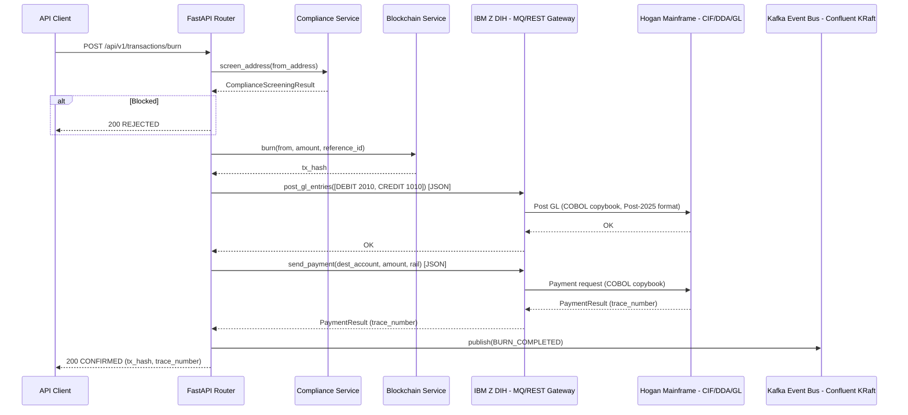
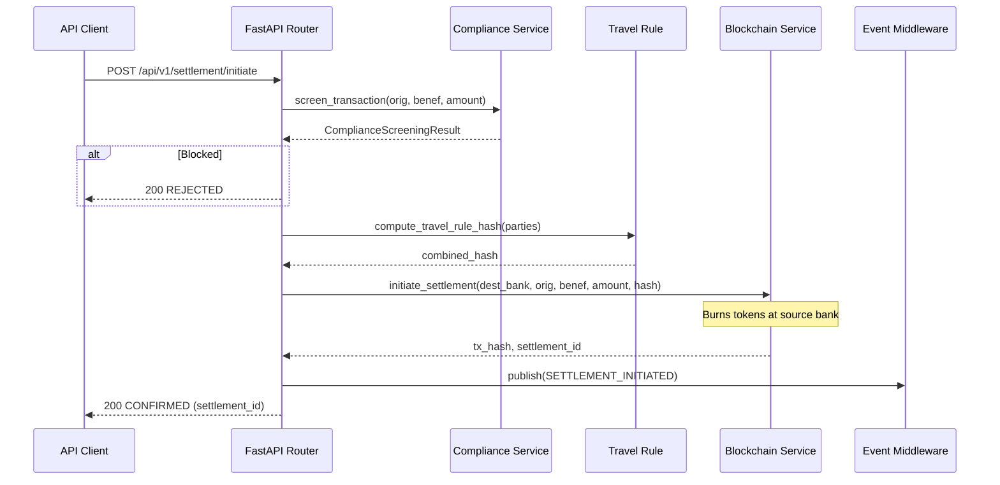
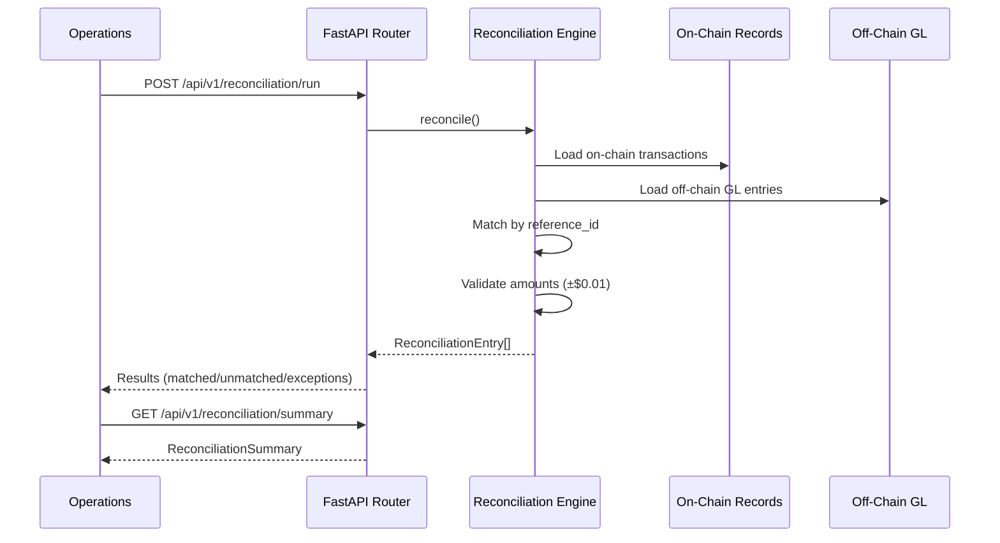
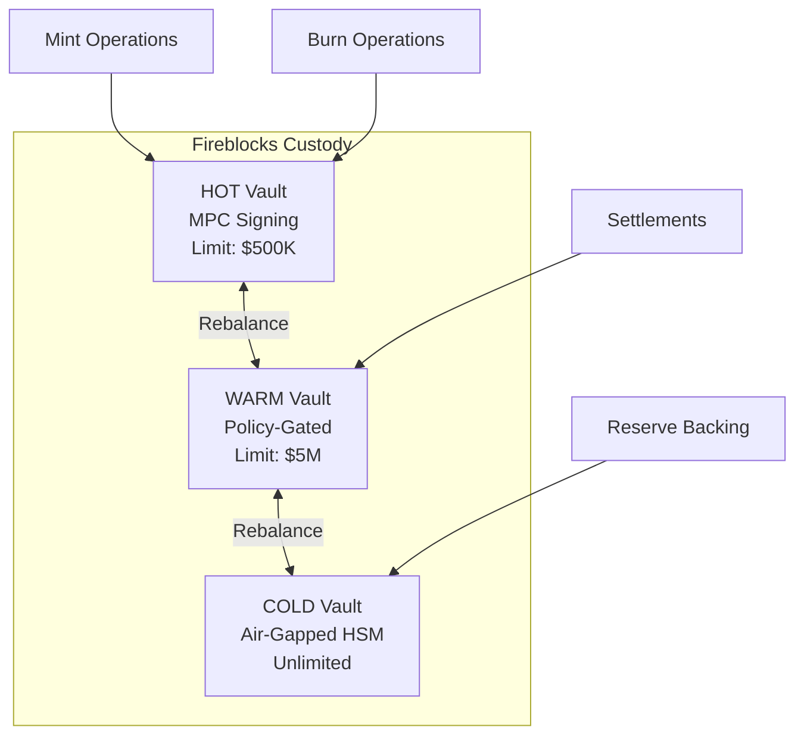

# Quest 2 — Off-Chain Orchestration Platform

## Architecture Flow Diagrams

### The Issuing Bank Technology Stack Integration

- **Hogan mainframe** (IBM Z) — Core banking (CIF/DDA/GL)
- **IBM Z DIH** — MQ/REST gateway for API-to-Hogan integration
- **Kafka** (Confluent Platform, KRaft mode) — Event bus
- **Azure AKS** — Kubernetes orchestration
- **Azure ACR** (cari-platform.azurecr.io) — Container registry
- **Azure Managed HSM** — Key management

### Mint Flow - Fiat Deposit to Tokenized Deposit via Hogan/Z DIH

### Burn Flow - Par Redemption - GENIUS Act S5 via Hogan/Z DIH

### Cari Settlement Flow - Cross-Bank

### Reconciliation Flow

### Custody Tier Architecture

