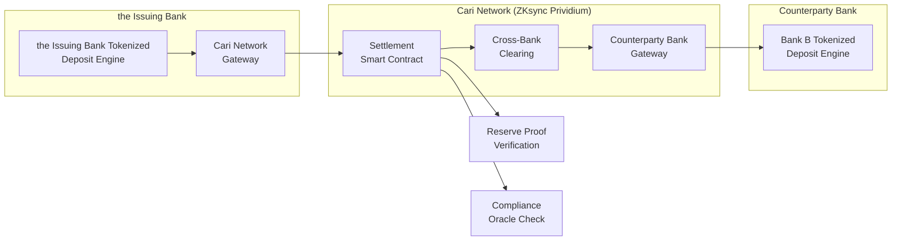

# Roadmap to Full Cari Network Production

**the Issuing Bank | Tokenized Deposit Platform**
**Target:** Q4 2026 Production Launch
**Classification:** CONFIDENTIAL -- Internal Use Only

---

## 1. Roadmap Overview

```mermaid
gantt
    title the Issuing Bank Cari Network Tokenized Deposit Roadmap
    dateFormat  YYYY-MM-DD
    axisFormat  %b %Y

    section Foundation (Complete)
    Quest 0: StableArch Council          :done, q0, 2025-06-01, 2025-08-01
    Quest 1: Smart Contracts (Prividium)  :done, q1, 2025-08-01, 2025-10-01
    Quest 2: Off-Chain Orchestration      :done, q2, 2025-10-01, 2025-12-01
    Quest 3: Security/Compliance Layer    :done, q3, 2025-12-01, 2026-02-01
    Quest 4: Executive Package            :done, q4, 2026-02-01, 2026-03-21

    section Phase 1: Internal Pilot
    ARB Submission & Approval             :p1a, 2026-04-01, 2026-05-15
    Vendor Onboarding (Fireblocks, Chainalysis) :p1b, 2026-04-15, 2026-06-30
    Internal Testnet Deployment           :p1c, 2026-05-01, 2026-06-30
    Security Audit (Trail of Bits / OpenZeppelin) :p1d, 2026-05-15, 2026-07-15
    Internal UAT (the Issuing Bank Treasury Ops)       :p1e, 2026-06-01, 2026-07-31

    section Phase 2: Prividium Mainnet
    Prividium Mainnet Deployment          :p2a, 2026-07-01, 2026-08-15
    OCC/FDIC Regulatory Filing            :p2b, 2026-07-15, 2026-09-15
    Intra-Bank Settlement Go-Live         :p2c, 2026-08-01, 2026-09-30
    Examiner Walkthrough                  :p2d, 2026-09-01, 2026-09-30

    section Phase 3: Cari Network Launch
    Inter-Bank Settlement (Cari Founding Banks) :p3a, 2026-10-01, 2026-11-30
    Liquidity Sharing Protocol            :p3b, 2026-10-15, 2026-12-15
    Production Launch (Q4 2026)           :milestone, p3m, 2026-12-01, 0d
    Post-Launch Monitoring (90 days)      :p3c, 2026-12-01, 2027-03-01
```

---

## 2. Phase 1: Internal Pilot (Q2 2026)

### Objectives
- Obtain ARB approval and begin vendor procurement
- Deploy full stack on Prividium testnet
- Complete independent security audit
- Run internal UAT with the Issuing Bank Treasury Operations

### Key Milestones

| Milestone | Target Date | Owner | Dependencies |
|-----------|-------------|-------|--------------|
| ARB package submitted | Apr 1, 2026 | Digital Assets Team | Quest 4 complete |
| ARB conditional approval | May 15, 2026 | Architecture Review Board | ARB submission |
| Fireblocks enterprise agreement signed | May 30, 2026 | Procurement / Legal | ARB approval |
| Chainalysis KYT extended to Cari | Jun 15, 2026 | Compliance Tech | Vendor agreement |
| Testnet deployment complete | Jun 30, 2026 | Engineering | Vendor onboarding |
| Security audit report received | Jul 15, 2026 | CISO Office | Audit engagement |
| Internal UAT sign-off | Jul 31, 2026 | Treasury Operations | Testnet deployment |

### Deliverables
- Fully functional testnet environment with all Quest 1-4 components
- Security audit report with all CRITICAL/HIGH findings remediated
- UAT sign-off from Treasury Operations, Compliance, and Risk
- Updated risk register reflecting audit findings

---

## 3. Phase 2: Prividium Mainnet (Q3 2026)

### Objectives
- Deploy production smart contracts on ZKsync Prividium mainnet
- File regulatory notifications with OCC and FDIC
- Launch intra-bank settlement (the Issuing Bank internal transfers)
- Complete examiner walkthrough for OCC/NYDFS

### Key Milestones

| Milestone | Target Date | Owner | Dependencies |
|-----------|-------------|-------|--------------|
| Prividium mainnet contracts deployed | Aug 15, 2026 | Engineering | Audit remediation |
| OCC Activity Letter filed | Aug 1, 2026 | Legal / Regulatory | ARB approval |
| FDIC notification submitted | Aug 1, 2026 | Legal / Regulatory | ARB approval |
| Intra-bank settlement live (internal) | Sep 30, 2026 | Operations | Mainnet deployment |
| OCC examiner walkthrough complete | Sep 30, 2026 | Compliance | Examiner dashboard |
| NYDFS 500 compliance attestation | Sep 30, 2026 | CISO | Security layer |

### Regulatory Filing Strategy

```
OCC Activity Letter
  - Novel activity notification under OCC Interpretive Letter 1179
  - Include: ARB package, security audit, risk matrix, control evidence
  - Expected timeline: 45-60 day review

FDIC Notification
  - Section 333.4 technology notification
  - Include: Architecture overview, FDIC insurance treatment memo
  - Expected timeline: 30-45 day review

NYDFS
  - No separate filing required (existing bank charter)
  - Compliance demonstrated via 23 NYCRR 500 attestation
  - Examiner transparency dashboard available on demand
```

---

## 4. Phase 3: Cari Network Production Launch (Q4 2026)

### Objectives
- Enable inter-bank settlement with Cari Network founding banks
- Launch liquidity sharing protocol for tokenized deposits
- Achieve production launch milestone (December 2026)
- Establish 90-day post-launch monitoring baseline

### Key Milestones

| Milestone | Target Date | Owner | Dependencies |
|-----------|-------------|-------|--------------|
| Cari Network inter-bank channel live | Nov 30, 2026 | Cari Network Team | Member bank readiness |
| First inter-bank tokenized deposit transfer | Nov 30, 2026 | Operations | Inter-bank channel |
| Liquidity sharing protocol active | Dec 15, 2026 | Engineering | Inter-bank settlement |
| **PRODUCTION LAUNCH** | **Dec 1, 2026** | **the Head of Digital Assets / Digital Assets** | All Phase 2 complete |
| 30-day post-launch review | Jan 1, 2027 | Operations / Risk | Production launch |
| 90-day post-launch review | Mar 1, 2027 | All stakeholders | Production launch |

### Inter-Bank Settlement Architecture



### Liquidity Sharing Model

Inter-bank liquidity on Cari Network enables:
- **Instant settlement** between founding banks (vs. T+1 traditional)
- **Shared liquidity pools** for tokenized deposit transfers
- **Atomic DvP** for tokenized securities settlement
- **Reduced nostro/vostro balances** across participating banks

---

## 5. Post-Launch Roadmap (2027)

| Quarter | Initiative | Description |
|---------|-----------|-------------|
| Q1 2027 | Post-launch stabilization | 90-day monitoring, incident response tuning, performance optimization |
| Q2 2027 | Programmable escrow | Smart contract escrow for commercial real estate closings |
| Q2 2027 | Tokenized treasury management | Automated sweep/investment of idle tokenized deposits |
| Q3 2027 | Tokenized repo/lending | Collateralized lending using tokenized deposits |
| Q3 2027 | Additional Cari Network banks | Onboard 3-5 additional founding bank partners |
| Q4 2027 | Cross-border pilot | International settlement via Cari Network bridge |
| Q4 2027 | CBDC bridge readiness | Integration layer for potential Fed wholesale CBDC |

---

## 6. Risk-Gated Go/No-Go Criteria

Each phase transition requires explicit sign-off:

### Phase 1 -> Phase 2 Gate

| Criterion | Required | Owner |
|-----------|----------|-------|
| ARB approval (conditional or full) | Yes | ARB Chair |
| Security audit -- zero CRITICAL findings open | Yes | CISO |
| All 16 regulatory controls implemented & tested | Yes | Compliance |
| UAT sign-off from Treasury Operations | Yes | Head of Treasury Ops |
| Vendor contracts executed (Fireblocks, Chainalysis) | Yes | Procurement |

### Phase 2 -> Phase 3 Gate

| Criterion | Required | Owner |
|-----------|----------|-------|
| OCC acknowledgment received (no objection) | Yes | Legal / Regulatory |
| FDIC notification acknowledged | Yes | Legal / Regulatory |
| Mainnet contracts operational for 30+ days | Yes | Engineering |
| Zero P1/P2 incidents in preceding 30 days | Yes | Operations |
| Examiner walkthrough complete (no material findings) | Yes | Compliance |
| Inter-bank settlement tested with 1+ Cari partner | Yes | Cari Network Team |

---

## 7. Resource Requirements

| Role | Phase 1 | Phase 2 | Phase 3 | Ongoing |
|------|---------|---------|---------|---------|
| Blockchain Engineers | 3 | 3 | 2 | 2 |
| Backend Engineers (FastAPI/Python) | 2 | 2 | 1 | 1 |
| DevOps/SRE | 1 | 2 | 2 | 1 |
| Compliance/Risk Analysts | 2 | 2 | 1 | 1 |
| QA Engineers | 1 | 1 | 1 | 1 |
| Project Manager | 1 | 1 | 1 | 0.5 |
| **Total FTEs** | **10** | **11** | **8** | **6.5** |

---

*Prepared by StableArch Council -- Strategic Advisory Agent*
*Document Version: 1.0 | Target: Q4 2026 Production Launch*
